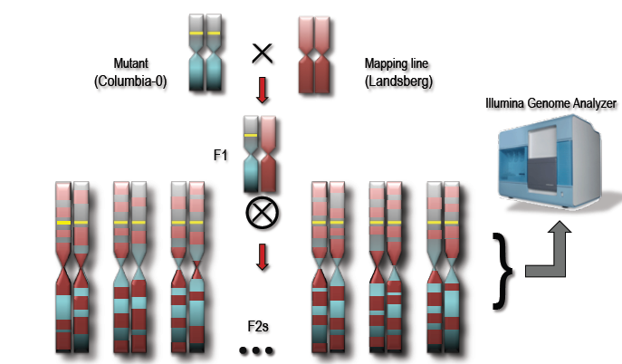

# Mutagenesis

## Learning Objectives
 
 * Mutagens make changes in a genome
 * EMS creates Single Nucleotide Polymorphisms of C->T or G->A Transition (mostly)
 * Careful crossing gives us homozygous mutant lines
 * Genetic screens select lines with changes related to our interest

## Mutagenesis with EMS

The first step is to mutagenise a population of organisms, or cells or similar. Mutagenesis is basically causing damage to DNA. Lot's of things can do this, Wikipedia has a great page on [mutagens](https://en.wikipedia.org/wiki/Mutagen). In plant genetics, the mutagen we typically use for changing single nucleotides in DNA, things we call point mutations or Single Nucleotide Polymorphisms (SNPs), is EMS - [Ethyl methanesulfonate](https://en.wikipedia.org/wiki/Ethyl_methanesulfonate). EMS will predominantly make C's change to T's and G's change to A's. These mutations are distributed fairly uniformly throughout the genome.

In practice we take a load of plant seeds and soak them in a solution of EMS. The EMS soaks in and damages the plant's DNA. 

This damages the DNA in **some** but **not all** of the cells in the seed.

## Getting a population homozygous for EMS induced mutations

We grow up the seed (let's call the plants that grow up the M1 generation) and the cells in those M1 plants that descended from the mutagenised cells carry the mutations. Sometimes these will be cells in the germline - ones that beget seeds. The progeny of the M1 plants, that grow from mutation carrying seeds (let's call these progeny the M2) will all grow up with the mutation **in every cell** and eventually, by identifying the progeny plants carefully, we can get a population of plants which are homozygous for all the EMS SNP mutations we induced.  

(ref:mutagenesis) A plant mutagenesis scheme from @Page:2002vm.

(\#fig:mutagenesis)(ref:mutagenesis)

This same principle is true for any organism. Whatever you want to do mutational genomics with, you will need to:

 1. mutate
 2. select
 3. cross
 4. screen 

## Genetic screens  

Once we have a mutagenised population we can start to select the individuals in that population that show some change in the phenotype of interest, say flowering time. We can use further crosses to bring in extra variation or use the natural variation - both of which are heterozygous - while keeping the homozygous mutation(s) that is (are) causing the phenotype by constantly selecting for offspring that show the phenotype of interest everytime we carry out crosses.  

(ref:tallplant) One of these plants is affected in the pathways that control flowering time - the right hand plant flowers early. Source: Detlef Weigel

(\#fig:tallplant)(ref:tallplant)

## Recombination during crossing causes changes in SNP density away from the site of mutation

All these crosses cause recombination in the chromosomes that bring in homologous parts from the line being used to cross. This happens at a greater frequency away from the mutation that we are selecting for such that regions further from the selected mutation carry fewer and fewer of the homozygous mutations.  

(ref:crossing) Consider crossing two chromosomes. Recombination causes the parts furthest from the selected mutation to lose the homozygous mutations as a function of distance from the selected mutation. Source: [Ryan Austin](http://bar.utoronto.ca/ngm/description.html)

(\#fig:ngm)(ref:crossing)

This statistical difference, a region of high homozygous SNPs around the mutation is what we will use to identify the SNPs that cause our phenotype of interest.

## Section Quiz

Please now complete the section quiz at [this link](https://goo.gl/forms/RLGLndlcEcoV8c742)
