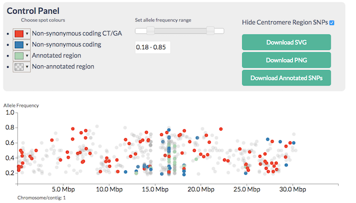
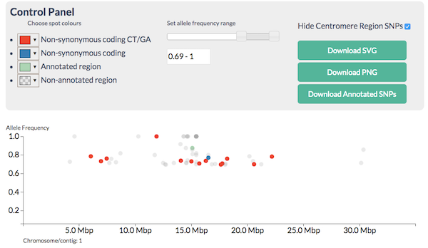

# Visualising SNPs To Find Candidates

## Learning Objectives

  * Understand CandiSNP output
  * Plotting frequencies of SNPs of different types across the chromosome

## Annotation

Once we've called SNPs, then the next stage is to annotate them. We are looking for heterozygous and homozygous information, which we get from the SNP callers, but a phenotype causing SNP is much more likely to cause a change in the protein that is encoded. Thus we need to know what the effect of the SNP on the protein is.

These qualities are what we will look for in our candidate SNP approach - the most likely mutation causing SNPs will be:

  * Homozygous
  * Non-synonymous
  * In a region enriched with homozygous SNPs
	
### SNPEff 

We can annotate SNPs with a program called `SNPEff`. SNPEff [@Cingolani:2012cz] is a fairly straightforward system. It needs a database of SNPs and a database of gene and gene/transcript positions and can give you whether the SNP is in a gene and whether the SNP causes a silent [synonymous](https://en.wikipedia.org/wiki/Synonymous_substitution) change (IE the codon the SNP changes is for the same amino acid before and after the SNP sequence change ) or whether it causes a more significant [non-synonymous](https://en.wikipedia.org/wiki/Nonsynonymous_substitution) change that actually changes the amino acid at that codon so the protein changes.   

Once we have a list of SNPs that we are happy with and have annotated them with SNPEff, there are a couple of approaches we can take to start finding candidates that may be our causative mutation.

The approach we take will depend on the genetic background. As we discussed at the start, we are generally looking for a region of high homozygous SNPs, but the frequency of other SNPs will depend on the cross. A wide cross from a fairly distant relative (like a different strain or ecotype) as is commonly used in genetic mapping strategies will allow us to make use of the heterozygous SNPs as a control. 

## CandiSNP

Fast interactive visualisations are a great help in finding the recombinant region and narrowing the candidates. One tool that allows us to do this is `CandiSNP`. CandiSNP [@Etherington:2014ba] is a JavaScript visualisation package that allows interactive filtering and highlighting of SNPs across whole chromosomes (DISCLAIMER: My group wrote this!). The tool isn't available inside Galaxy, but is on the web at [http://candisnp.tsl.ac.uk](http://candisnp.tsl.ac.uk). A significant advantage of CandiSNP is that is has SNPEff built into it. So you can use the unannotated SNP file straight in CandiSNP.

(ref:candisnp) Screenshot of the CandiSNP tool. Spots represent SNPs (height on the `y` axis shows major allele frequency).

(\#fig:csnpb4)(ref:candisnp)

CandiSNP allows you to look at the SNPs like in Figure \@ref(fig:csnpb4) and apply filters to narrow down the region and candidates so you see something like Figure \@ref(fig:csnp). CandiSNP takes a VCF file as input.

(ref:candisnpf) CandiSNP after filtering. The region of the high red spot density is the recombinant region

(\#fig:csnp)(ref:candisnpf)

## Density plots

Statistical methods are useful when the number of SNPs generated is so large that you can't visualise them all at the same time. Density plots like Figure \@ref(fig:densityp) (which is of the same data as the CandiSNP plot in \@ref(fig:csnpb4) help us to see the rough patterns in a similar way. The homozygous and heterozygous show an increase in the SNP-rich centromeric region which biases the data and an overall decrease at the far right of the chromosome, but the enriched region is visible in the high ratio at about 17Mbp as in the CandiSNP output. These kinds of plots can be generated with Galaxy's plotting tools.

(ref:density) Density plot of homozygous, heterozygous SNP density and the ratio of hom/het SNPS in sliding windows

(\#fig:densityp)(ref:density)

## Centromeres
 Centromeres are a real problem with these sorts of analysis. They are so SNP rich that they swamp analysis and visualisations. It helps to just screen them out from the analysis. CandiSNP will let you turn off centromeres associated SNPs, Galaxy tools can also help you filter them out.
 

## SNP Deletion - Fewer are better

Perhaps it is counter-intuitive but getting fewer SNPs is often better in these approaches. A common source of confounding SNPs is from the parental line itself. All individuals of any species have differences in the genomes from the references we use to call SNPs, and some (perhaps many) of these will be shared between the parent used to generate the mutants and the mutants. By sequencing the parent line and calling SNPs between it and the reference genome, you get a list of parental SNPs that you can often delete straight out of the mutant as being non-causative. 

## Exercises

### Analyse SNP data with CandiSNP

You have some whole genome _Arabidopsis_ SNP data annotated with SNPEff in the shared data library `Annotation`, the VCF file `filtered_snps.vcf`. Use this in the web version of CandiSNP tool at [] This data set is a real one and we know exactly where the mutation is because we've sequenced it, so there is a _right_ answer. Use the sliders and filter tools to find a region enriched in homozygous candidate SNPs.

  1. Can you come up with candidate regions / genes for the causative mutation?
  2. Which is more useful, filtering or colouring?
  3. How much extra information does knowing the genes the SNPs fall in give? In this specific training case and in a real case where you might know something about the biology already.

### Generate density plots of different SNP classes

Standard Galaxy tools can generate histograms of data. However the data needs to be in tabular format, not VCF. Here's a little recipe for going from VCF to a table that is useful.

  1. To make a tabular file, use the `Text Manipulation .. Cut Columns Tool`. Cut out columns `c1,c2,c3,c4,c8,c9`. 
  2. To strip text from the AF field and just leave the numbers, use the `Text Manipulation .. Trim Leading` on `column 5`, trim to position `4` and set to `ignore` `#`.
  3. To get the homozygous SNPs, use the `Filter and Sort .. Filter data on any column` tool. Filter on `c5>=0.75` (or whatever seems sensible to you).
  4. To get the heterozygous SNPs, do step `3` again but filter on `c5<0.75`.

This will leave you with two files on which to carry out the remaining steps.

  5. To split the files into single chromosome files use `Text Manipulation .. Split file according to value of a column` use `column 1` (the chromosome column)
  6. For each resulting file you can use `Plotting .. Histogram` to make the histograms. It is useful to add the density plot and to use around 150 breaks.

With a bit more work you can combine the different plots into one large one for easier comparison, and you can use sliding window tools to calculate the ratio of Hom/Het SNPs across the chromosomes.

### Comparing density plots

  1. Use the numerous density plots you made to compare the likely positions of the causative SNPs
  2. Can you narrow down the area sufficiently to examine the text list in more detail?
  3. What further filtering could you do to make the plots more effective?
